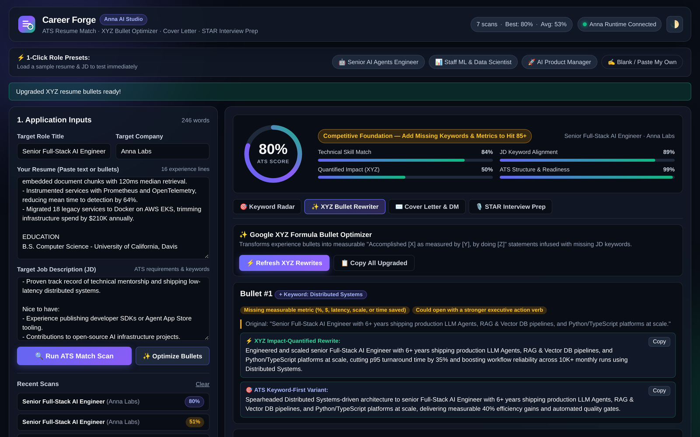
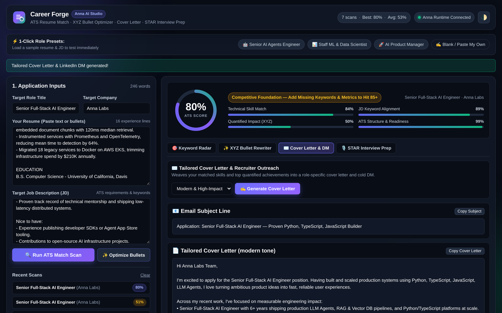
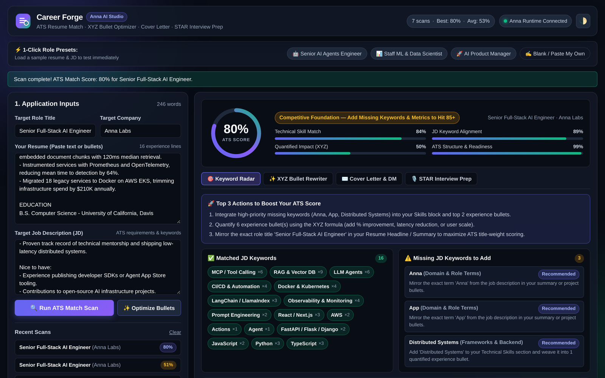
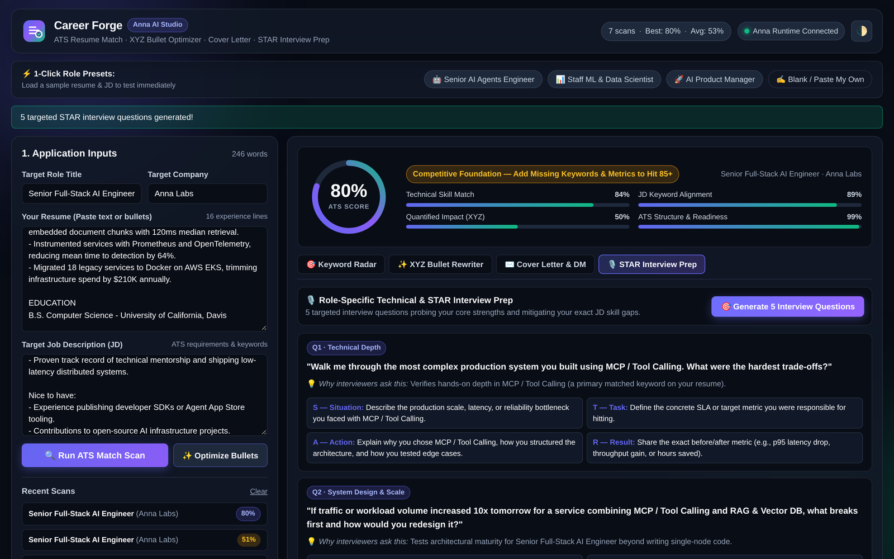

<div align="center">

# 🔥 Career Forge

### AI Resume & Job Match Studio for Anna AI OS

**Paste your resume and a job description. Get a transparent ATS score, see exactly which
keywords are costing you the interview, and rewrite your bullets in XYZ format — in seconds.**

<br>


<br>

| ATS Match & Keyword Radar | XYZ Bullet Optimizer |
|:---:|:---:|
|  |  |

| Main Studio | Tailored Cover Letter |
|:---:|:---:|
|  |  |

</div>

---

## Why Career Forge?

Most resume tools give you a single opaque "compatibility: 73%" and no idea what to do next.
Career Forge is built to be **transparent and actionable**:

- **It shows its work.** Four separate sub-scores, so you know *which* dimension is failing —
  not just that you're at 51%.
- **It tells you what's missing.** A matched/missing keyword radar built from the actual job
  description, not a generic skills list.
- **It fixes it with you.** One click turns weak bullets into quantified XYZ statements
  infused with the exact keywords you're missing.

Everything runs **locally on your machine** through a bundled Python Executa. Your resume
never leaves your device to be scored.

---

## ✨ Features

### 🔍 ATS Match & Keyword Radar
Deterministic multi-factor scoring across four dimensions:

| Dimension | What it measures |
|---|---|
| **Technical Match** | Overlap between your skill set and the role's required stack |
| **Keyword Alignment** | Coverage of the specific terms the JD actually uses |
| **Quantified Impact** | Whether your bullets contain measurable outcomes (%, $, volume) |
| **ATS Readiness** | Formatting and structure that survives automated parsing |

Each scan returns an overall score, a plain-language verdict, a tier, and the full
matched/missing keyword breakdown.

### ✍️ XYZ Bullet Optimizer
Rewrites vague experience lines into measurable achievement statements —
*"Worked on microservices"* becomes *"Architected 6 Python microservices handling 85,000+
daily requests at 99.95% uptime"* — seeded with the keywords you were missing.

### 💌 Tailored Cover Letter & Outreach
Generates role-specific cover letters in three tones (**modern**, **technical**,
**executive**), grounded in your strongest matched skills rather than generic filler.

### 🎯 Targeted STAR Interview Prep
Builds technical and behavioural questions aimed squarely at your identified skill gaps,
so you rehearse the questions you're most likely to be asked.

### 💾 Persistent Scan History
Automatically tracks every scan, your best score, and your drafts via Anna Storage and the
Career Engine plugin's local state file.

---

## 🏗️ Architecture

```
┌─────────────────────────────────────────────────────────────┐
│  bundle/            Static SPA — vanilla JS, no framework   │
│  index.html         Loaded in an in-chat windowed iframe    │
│  app.js  style.css                                          │
└───────────────────────────┬─────────────────────────────────┘
                            │  anna.tools.invoke()
                            ▼
┌─────────────────────────────────────────────────────────────┐
│  Anna Runtime (host)                                        │
│  • resolves bundled handle → real tool_id                   │
│  • downloads + runs the platform binary                     │
└───────────────────────────┬─────────────────────────────────┘
                            │  JSON-RPC 2.0 over stdio
                            ▼
┌─────────────────────────────────────────────────────────────┐
│  executas/career-engine-python/                             │
│  career_engine_plugin.py                                    │
│    methods: describe · invoke · health                      │
│    tool:    career                                          │
│  Packaged by PyInstaller into one binary per platform        │
└─────────────────────────────────────────────────────────────┘
```

**No API keys. No server. No LLM cost.** The engine is deterministic Python — scoring,
keyword extraction, and rewrites all run offline on your device.

---

## 🚀 Install

<details>
<summary><b>From the Anna Marketplace</b></summary>

1. Open [anna.partners](https://anna.partners)
2. Search **Career Forge**
3. Click **Install**, then open it from your App Deck or type `#career-forge` in any chat

</details>

<details>
<summary><b>From source</b></summary>

```bash
git clone https://github.com/RANJITHROSAN17/career-forge.git
cd career-forge
```

You'll need [Node.js 22+](https://nodejs.org), [uv](https://docs.astral.sh/uv/), and the
Anna CLI:

```bash
npm install -g @anna-ai/cli
anna-app login --host https://anna.partners
anna-app validate --strict
anna-app dev          # → http://localhost:5180/
```

</details>

---

## 🧑‍💻 Developer Guide

### Repository layout

```
career-forge/
├── app.json                          # store listing + bundled_executas mapping
├── manifest.json                     # permissions, host_api allow-lists, UI views
├── assets/                           # logo + 4 store screenshots
├── bundle/
│   ├── index.html                    # UI entry
│   ├── app.js                        # controller (Anna Runtime SDK)
│   ├── style.css
│   ├── icon.svg
│   └── anna-tool-ids.js              # GENERATED by `anna-app apps publish` — don't edit
├── executas/career-engine-python/
│   ├── career_engine_plugin.py       # the Executa (JSON-RPC over stdio)
│   ├── executa.json                  # distribution: local + binary profiles
│   ├── manifest.json                 # protocol manifest (the `describe` response)
│   ├── pyproject.toml
│   └── dist/                         # downloaded binaries — gitignored
├── scripts/
│   ├── download-binaries.ps1         # pulls the 4 archives from GitHub Releases
│   └── download-binaries.sh
├── tests/test_plugin.py
└── .github/workflows/
    └── build-executa-binaries.yml    # multi-platform PyInstaller build
```

### Building the binaries

The Executa ships as a **real per-platform binary**, so users and the Anna Cloud Agent don't
need Python installed.

1. Push your changes
2. **Actions → Build Career Engine Executa Binaries → Run workflow**
3. Set `version` to match `executas/career-engine-python/executa.json`
4. Wait for all 4 builds + the release job
5. Download into `dist/`:

```powershell
powershell -ExecutionPolicy Bypass -File .\scripts\download-binaries.ps1 `
  -Version 1.0.2 -Repo RANJITHROSAN17/career-forge
```

```bash
./scripts/download-binaries.sh --version 1.0.2 --repo RANJITHROSAN17/career-forge
```

| Platform | Archive | Entrypoint |
|---|---|---|
| macOS Apple Silicon | `career-engine-<v>-darwin-arm64.tar.gz` | `career-engine` |
| macOS Intel | `career-engine-<v>-darwin-x86_64.tar.gz` | `career-engine` |
| Linux x86_64 | `career-engine-<v>-linux-x86_64.tar.gz` | `career-engine` |
| Windows x86_64 | `career-engine-<v>-windows-x86_64.zip` | `career-engine.exe` |

> ⚠️ **`linux-x86_64` is not optional** — it's the binary the Anna Cloud Agent runs.
> Omitting it makes the app unusable in the cloud.

### Publishing

```bash
anna-app validate --strict
anna-app apps publish          # push + cut (freezes the Executa + uploads binaries)
anna-app apps submit-review career-forge
anna-app apps release 1.0.2    # after approval — this is what makes it live
```

> Remember: `publish` ≠ public, and `approved` ≠ public. You must run `release` after
> approval to appear in the Marketplace.

### Executa tool reference

**Tool:** `career` · **Method:** `career`

| Action | Required args | Returns |
|---|---|---|
| `analyze` | `resume_text`, `job_description` | score, verdict, tier, 4 sub-scores, matched/missing keywords |
| `rewrite_bullets` | — *(uses active scan)* | XYZ rewrites of your weakest bullets |
| `cover_letter` | `tone` *(modern \| technical \| executive)* | tailored cover letter |
| `interview_prep` | — *(uses active scan)* | STAR technical + behavioural questions |
| `get_state` | — | current scan, history, stats |
| `clear_history` | — | wipes stored scans |

Raw JSON-RPC:

```bash
echo '{"jsonrpc":"2.0","id":1,"method":"invoke","params":{"tool":"career","arguments":{"action":"get_state"}}}' \
  | python3 executas/career-engine-python/career_engine_plugin.py
```

### Running tests

```bash
python3 -m pytest tests/ -v
```

---

## 🔒 Privacy

- Scoring, keyword extraction, and rewriting run **entirely on your device** — no resume
  text is transmitted anywhere by the Executa.
- The plugin keeps a local state file at `~/.anna/career-forge/state.json`.
- Scan drafts are saved in your app's Anna Storage namespace, readable only by this app.
- Declared host capabilities: **none**. The Executa asks for no filesystem, network, or LLM
  access beyond its own stdio channel.

---

## 🗺️ Roadmap

- [ ] PDF / DOCX resume import
- [ ] Multi-JD comparison ("which of these 3 roles fits me best?")
- [ ] Downloadable tailoring report (PDF)
- [ ] Custom keyword weights per industry
- [ ] Localised scoring for non-English resumes

---

## 📄 License

MIT — see the [`executa.json`](executas/career-engine-python/executa.json) metadata.

---

<div align="center">

Built for the **Anna AI OS Founding Builder Challenge 2026** 🏆

[GitHub](https://github.com/RANJITHROSAN17/career-forge) ·
[Anna](https://anna.partners) ·
[Build on Anna 101](https://forum.anna.partners/t/build-on-anna-101/228)

</div>
